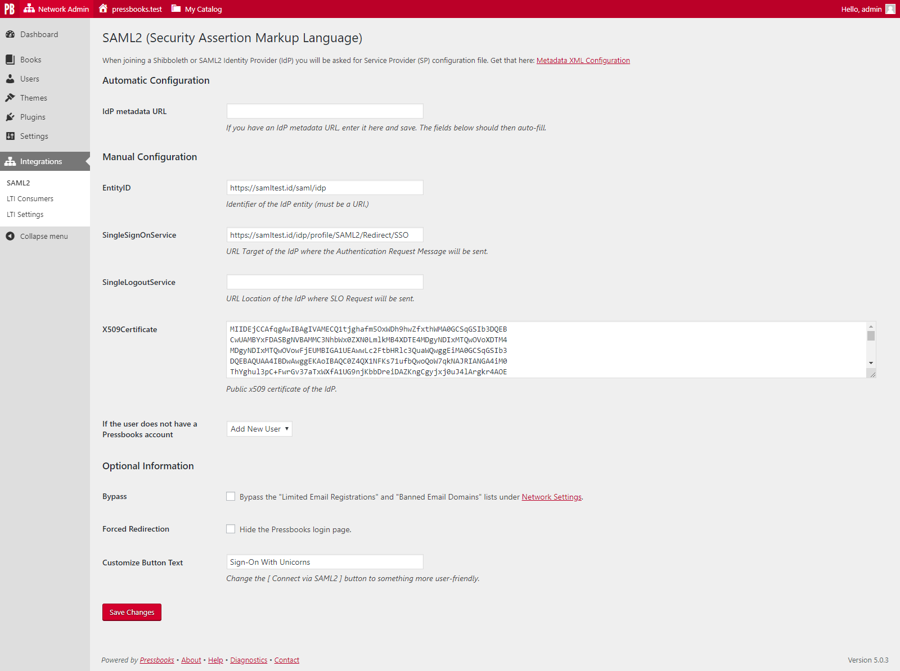
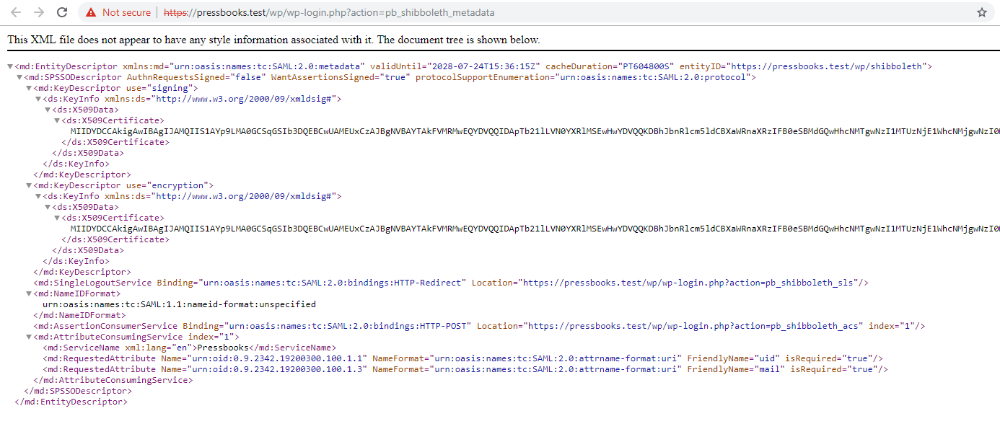

# Pressbooks SAML2 Single Sign-On

Contributors: conner_bw, greatislander, richard015ar, steelwagstaff
Tags: pressbooks, saml, saml2, sso, shibboleth
Requires at least: 6.2.2
Tested up to: 6.2.2
Stable tag: 2.4.0
Requires PHP: 8.1
License: GPLv3 or later
License URI: https://www.gnu.org/licenses/gpl-3.0.html

SAML2 Single Sign-On integration for Pressbooks.

## Description

[](https://packagist.org/packages/pressbooks/pressbooks-saml-sso) [](https://github.com/pressbooks/pressbooks-saml-sso/releases) [](https://travis-ci.com/pressbooks/pressbooks-saml-sso/) [](https://codecov.io/gh/pressbooks/pressbooks-saml-sso)

Plugin to integrate Pressbooks with a SAML2 single sign-on service. ([Shibboleth](https://www.shibboleth.net/), [Microsoft ADFS](https://support.zendesk.com/hc/en-us/articles/203663886-Setting-up-single-sign-on-using-Active-Directory-with-ADFS-and-SAML-Professional-and-Enterprise-), [Google Apps](https://pantheon.io/docs/wordpress-google-sso/), Etc.)

Users who attempt to login to Pressbooks are redirected to a Shibboleth or SAML2 Identity Provider. After the user’s credentials are verified, they are redirected back to the Pressbooks network. If we match a Pressbooks user by UID (stored in user_meta table), the user is recognized as valid and allowed access. If no match, then try to match a Pressbooks user by email (and store a successful match in user_meta table for next time). If the user does not have an account in Pressbooks, a new user can be created, or access can be refused, depending on the configuration.

Limitations: This plugin does not enable authentication with multilateral Shibboleth. For use in a non-federated, bilateral configuration, with a single IdP.

## Installation

```
composer require pressbooks/pressbooks-saml-sso
```

Or, download the latest version from the releases page and unzip it into your WordPress plugin directory: https://github.com/pressbooks/pressbooks-saml-sso/releases

Then, create the necessary certificates:

```
cd vendor/onelogin/php-saml/certs
openssl req -newkey rsa:2048 -new -x509 -days 3652 -nodes -out sp.crt -keyout sp.key
```

Then, activate and configure the plugin at the Network level.

### Security Considerations

Generating certificates in `vendor/onelogin/php-saml/certs`, without further changes, will expose them to malicious users (Ie. `https://path/to/vendor/onelogin/php-saml/certs/sp.crt`).
Furthermore, your certificates are at risk of being deleted when updating packages using `composer update` or similar commands. A competent sysadmin must make sure certificates are not accessible from the internet nor deleted. It is highly recommended that you pass your certificates via configuration variables. Example:

```php
add_filter( 'pb_saml_auth_settings', function( $config ) {
	$config['sp']['x509cert'] = file_get_contents( '/path/to/sp.key' );
	$config['sp']['privateKey'] = file_get_contents( '/path/to/sp.crt' );
	return $config;
} );
```

Or:

```php
define( 'PHP_SAML_SP_KEY_PATH', '/path/to/sp.key' );
define( 'PHP_SAML_SP_CERT_PATH', '/path/to/sp.crt' );
```

### IdP Setup

Upon activation of the plugin, a submenu item ("SAML2") is added to the Network Admin interface under "Integrations". This leads to the SAML2 settings page. Your metadata XML can be downloaded from this page.

The plugin requires the Assertion elements of the Response to be signed.

The plugin looks for the following Attributes in the Response:

+ Requires: `urn:oid:0.9.2342.19200300.100.1.1` (samAccountName or equivalent, ideally with FriendlyName `uid`)
+ Strongly recommends: `urn:oid:0.9.2342.19200300.100.1.3` (email-address or equivalent, ideally with FriendlyName `mail`). If no value is available we fall back to `uid@127.0.0.1`
+ Optional: `urn:oid:1.3.6.1.4.1.5923.1.1.1.6` (eduPersonPrincipalName or equivalent). Upon the first launch for a given user, if mail cannot match an existing person, and this value is present, we'll try to use it.

The email can be filtered, example: `add_filter( 'pb_integrations_multidomain_email', function( $email, $uid, $plugin ) { /* Custom use case, return $email */ }, 10, 3 );`

Because this plugin uses the fabulous [onelogin/php-saml](https://github.com/onelogin/php-saml/) toolkit, [many other configuration variables can be tweaked](https://github.com/onelogin/php-saml/#settings).

## Sending logs
If you use AWS and want to log SAML attempts on your server, you will need define some environment variables on the server which is hosting your Pressbooks instance.
### AWS S3
Define the following environment variables:

 ```
  LOG_LOGIN_ATTEMPTS (setting this value to true will enable this feature at the infrastructure level)
  AWS_ACCESS_KEY_ID
  AWS_SECRET_ACCESS_KEY
  AWS_S3_OIDC_BUCKET
  AWS_S3_REGION
  AWS_S3_VERSION
```
After these variables have been properly defined, basic information about SAML login attempts will be logged to your S3 bucket. A new CSV file will be created each month so that the logs remain readable. Log storage will take place in a folder structure that looks like this `S3 Bucket > saml_logs > {ENVIRONMENT} > {Network URL hashed though wp_hash function} > {YYYY-MM} > saml_logs.log`.

### AWS CloudWatch Logs
Define the following envirnoment variables:

 ```
  LOG_LOGIN_ATTEMPTS (setting this value to true will enable this feature at the infrastructure level)
  AWS_ACCESS_KEY_ID
  AWS_SECRET_ACCESS_KEY
  AWS_S3_REGION
  AWS_S3_VERSION
```
After these variables have been properly defined, basic information about SAML login attempts will be logged in your AWS CloudWatch Logs service in JSON format. You will need to create a new Log group called `pressbooks-logs`.

## Screenshots





## Changelog

### 2.4.0
* See: https://github.com/pressbooks/pressbooks-saml-sso/releases/tag/2.4.0
* Full release history available at: https://github.com/pressbooks/pressbooks-saml-sso/releases

## Upgrade Notices
### 2.2.0
Pressbooks SAML2 Single Sign-On 2.2.0 requires PHP >= 8.0
Pressbooks SAML2 Single Sign-On 2.2.0 requires WordPress >= 6.1.1
Pressbooks SAML2 Single Sign-On 2.2.0 requires Pressbooks >= 6.4.0

### 2.0.0
Pressbooks SAML2 Single Sign-On Requires Pressbooks >= 6.0.0

### 1.6.1
Pressbooks SAML2 Single Sign-On Requires Pressbooks >= 5.34.1

### 1.3.1
Pressbooks SAML2 Single Sign-On requires Pressbooks >= 5.20.1

### 1.3.0
Pressbooks SAML2 Single Sign-On requires Pressbooks >= 5.19.0

### 1.1.1
Pressbooks SAML2 Single Sign-On requires Pressbooks >= 5.10.1
